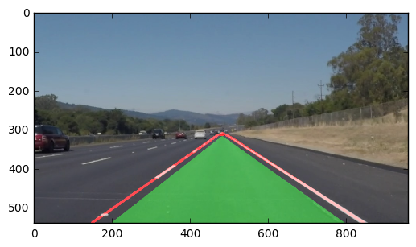

# **Finding Lane Lines on the Road** 
***
In this project, you will use the tools you learned about in the lesson to identify lane lines on the road.  You can develop your pipeline on a series of individual images, and later apply the result to a video stream (really just a series of images). Check out the video clip "raw-lines-example.mp4" (also contained in this repository) to see what the output should look like after using the helper functions below. 

Once you have a result that looks roughly like "raw-lines-example.mp4", you'll need to get creative and try to average and/or extrapolate the line segments you've detected to map out the full extent of the lane lines.  You can see an example of the result you're going for in the video "P1_example.mp4".  Ultimately, you would like to draw just one line for the left side of the lane, and one for the right.

---
Let's have a look at our first image called 'test_images/solidWhiteRight.jpg'.  Run the 2 cells below (hit Shift-Enter or the "play" button above) to display the image.

**Note** If, at any point, you encounter frozen display windows or other confounding issues, you can always start again with a clean slate by going to the "Kernel" menu above and selecting "Restart & Clear Output".

---

**The tools you have are color selection, region of interest selection, grayscaling, Gaussian smoothing, Canny Edge Detection and Hough Tranform line detection.  You  are also free to explore and try other techniques that were not presented in the lesson.  Your goal is piece together a pipeline to detect the line segments in the image, then average/extrapolate them and draw them onto the image for display (as below).  Once you have a working pipeline, try it out on the video stream below.**

---


```python
#importing some useful packages
import matplotlib.pyplot as plt
import matplotlib.image as mpimg
import numpy as np
import cv2
%matplotlib inline
```


```python
#reading in an image
image = mpimg.imread('test_images/solidWhiteRight.jpg')
#printing out some stats and plotting
print('This image is:', type(image), 'with dimesions:', image.shape)
plt.imshow(image)  # if you wanted to show a single color channel image called 'gray', for example, call as plt.imshow(gray, cmap='gray')
```

    This image is: <class 'numpy.ndarray'> with dimesions: (540, 960, 3)
    


    <matplotlib.image.AxesImage at 0x7f7a802b3780>


**Some OpenCV functions (beyond those introduced in the lesson) that might be useful for this project are:**

`cv2.inRange()` for color selection  
`cv2.fillPoly()` for regions selection  
`cv2.line()` to draw lines on an image given endpoints  
`cv2.addWeighted()` to coadd / overlay two images
`cv2.cvtColor()` to grayscale or change color
`cv2.imwrite()` to output images to file  
`cv2.bitwise_and()` to apply a mask to an image

**Check out the OpenCV documentation to learn about these and discover even more awesome functionality!**

Below are some helper functions to help get you started. They should look familiar from the lesson!


```python
import math

def grayscale(img):
    """Applies the Grayscale transform
    This will return an image with only one color channel
    but NOTE: to see the returned image as grayscale
    (assuming your grayscaled image is called 'gray')
    you should call plt.imshow(gray, cmap='gray')"""
    return cv2.cvtColor(img, cv2.COLOR_RGB2GRAY)
    # Or use BGR2GRAY if you read an image with cv2.imread()
    # return cv2.cvtColor(img, cv2.COLOR_BGR2GRAY)
    
def canny(img, low_threshold, high_threshold):
    """Applies the Canny transform"""
    return cv2.Canny(img, low_threshold, high_threshold)

def gaussian_blur(img, kernel_size):
    """Applies a Gaussian Noise kernel"""
    return cv2.GaussianBlur(img, (kernel_size, kernel_size), 0)

def line_func(points):
    """Calculates parameter of linear function"""
    # y = m*x + n
    # n = y - m*x

    x1 = points[0,0]
    y1 = points[0,1]
    x2 = points[0,2]
    y2 = points[0,3]
    
    #calculate linear function
    m = (y2 - y1) / (x2-x1)
    n = y1 - m*(x1)
    return m, n

def line_intersection_func(m1, n1, m2, n2):
        """Calculates intersection of two lines, defined by their parameters"""
        # m1*x+n1=m2*x+n2
        # m1x-m2x = n2 -n1
        # x(m1-m2) = n2-n1
        # x = (n2-n1)/(m1-m2)

        #check for division by zero - same m
        if m1-m2 == 0 and m1 != 0.0 and m1 < math.inf and m1 > -(math.inf) and m2 != 0.0 and m2 < math.inf and m2 > -(math.inf):
            #print("No intersection found")
            return
        else:
            x = int(round((n2-n1)/(m1-m2)))
            y = int(round(m1*x+n1))
            #print("Intersection found at: ", x,y)
            return x, y
               
def line_intersection_points(lines):
    """Calculates points of intersections for all lines"""
    size = lines.shape[0]
    intersection_points = []
    
    for i in range(size):
        m1, n1 = line_func(lines[i])
        #test intersection with all other lines except self
        if m1 != 0.0 and m1 < math.inf and m1 > -(math.inf):
            for n in range(size):
                if n != i:
                    m2, n2 = line_func(lines[n])
                    #check for horizontal, vertical lines and parallel lines
                    if m2 != 0.0 and m2 < math.inf and m2 > -(math.inf) and m1 != m2:
                        (x, y) = line_intersection_func(m1, n1, m2, n2)
                        if x != 0 and y != 0:
                            #print("Intersection found at: ", x, y)
                            intersection_points.append((x, y))
                        else:
                            continue
                            #print("No intersection found")           
    return intersection_points     
        
def keep_intersecting_lines(lines, intersection):
    """Deletes lines, which are not intersecting with intersection point"""
    size = lines.shape[0]
    indexes = []
    tolerance = 10   
    x, y = intersection
    
    for i in range(size):
        m, n = line_func(lines[i])
        #test intersection with point
        if m != 0.0 and m < math.inf and m > -(math.inf):
            if y <= int(round((m*x+n)))+tolerance and  y >= int(round((m*x+n)))-tolerance:
                #print("Intersection with point found")
                continue
            else:
                #print("No intersection with point found")
                indexes.append(i) 
        else:
            #print("vertical or horizontal lines)
            indexes.append(i) 
    new_lines = np.delete(lines, indexes, axis=0)
    return new_lines  
    
def extend_lines(lines, intersection, shape):
    """Extend lines to intersection point to visualize full lane length"""
    size = lines.shape[0]
    indexes = []
    y, x, dim = shape
    
    for i in range(size):
        m, n = line_func(lines[i])
        #check for zero or infinite slopes, vertical or horizontal lines
        if m != 0.0 and m < math.inf:
            x_0 = int(round(((y-n)/m)))
            y_0 = y
            if x_0 >= 0 and y_0 >= 0 and x_0 <= x and y_0 <= y:
                lines[i] = [intersection[0], intersection[1], x_0, y_0]
            else:
                indexes.append(i)  
    
    lines = np.delete(lines, indexes, axis=0)
    return lines
    
def region_of_interest(img, vertices):
    """
    Applies an image mask.
    
    Only keeps the region of the image defined by the polygon
    formed from `vertices`. The rest of the image is set to black.
    """
    #defining a blank mask to start with
    mask = np.zeros_like(img)   
    
    #defining a 3 channel or 1 channel color to fill the mask with depending on the input image
    if len(img.shape) > 2:
        channel_count = img.shape[2]  # i.e. 3 or 4 depending on your image
        ignore_mask_color = (255,) * channel_count
    else:
        ignore_mask_color = 255
        
    #filling pixels inside the polygon defined by "vertices" with the fill color    
    cv2.fillConvexPoly(mask, vertices, ignore_mask_color)
    
    #returning the image only where mask pixels are nonzero
    masked_image = cv2.bitwise_and(img, mask)
    return masked_image

# https://www.python-forum.de/viewtopic.php?t=9923
def get_value_with_maximum_frequency(iterable):
    """select most frequent intersection point"""
    freq_dict = dict()
    for elem in iterable:
        freq_dict[elem] = freq_dict.get(elem, 0) + 1
    count, point = max((point, count) for count, point in freq_dict.items())
    return point

def average_lines(lines):
    """calculate average endpoints of lanes on right side and left side"""
    
    """
    NOTE:    
    Think about things like separating line segments by their 
    slope ((y2-y1)/(x2-x1)) to decide which segments are part of the left
    line vs. the right line.  Then, you can average the position of each of 
    the lines and extrapolate to the top and bottom of the lane.
    """
        
    size = lines.shape[0] 
    leftLane = np.copy(lines)
    rightLane = np.copy(lines)
    leftLaneDeleteIndices = []
    rightLaneDeleteIndices = []
    
    for i in range(size):
        m, n = line_func(lines[i])
        points = lines[i]
        #check for zero or infinite slopes, vertical or horizontal lines
        if m != 0.0 and m < math.inf:
            if m > 0:
                leftLaneDeleteIndices.append(i)  
            elif m < 0:
                rightLaneDeleteIndices.append(i)
        else:
            leftLaneDeleteIndices.append(i)
            rightLaneDeleteIndices.append(i)
            
    leftLane = np.delete(leftLane, leftLaneDeleteIndices, axis=0)
    rightLane = np.delete(rightLane, rightLaneDeleteIndices, axis=0)
   
    if leftLane.shape[0] > 0 and rightLane.shape[0] > 0:
        avgLines = np.array([np.mean(leftLane, axis=0), np.mean(rightLane, axis=0)])
    elif leftLane.shape[0] == 0:
        return rightLane
    elif rightLane.shape[0] == 0:
        return leftLane
    
    avgLines = np.rint(avgLines).astype(int)
    return avgLines

def draw_lines(img, lines, color=[255, 0, 0], thickness=5):
    """
    NOTE: this is the function you might want to use as a starting point once you want to 
    average/extrapolate the line segments you detect to map out the full
    extent of the lane (going from the result shown in raw-lines-example.mp4
    to that shown in P1_example.mp4).  
    
    Think about things like separating line segments by their 
    slope ((y2-y1)/(x2-x1)) to decide which segments are part of the left
    line vs. the right line.  Then, you can average the position of each of 
    the lines and extrapolate to the top and bottom of the lane.
    
    This function draws `lines` with `color` and `thickness`.    
    Lines are drawn on the image inplace (mutates the image).
    If you want to make the lines semi-transparent, think about combining
    this function with the weighted_img() function below
    """
    #calculate intersection point
    points = line_intersection_points(lines)
    intersection = get_value_with_maximum_frequency(points)
    
    #check if point actually calculated and inside image and show intersection point
    if intersection >= (0,0) and intersection <= img.shape:
        cv2.circle(img, intersection, 10, color, -1)
    
    #for showing all points in point:
    #for point in intersections:
    #    cv2.circle(img, point, 10, color, -1)
    
    #keep only lines, that are crossing the intersection point
    lines = keep_intersecting_lines(lines, intersection)
    
    #extend lines to intersection point
    lines = extend_lines(lines, intersection, img.shape)
    
    #average lines
    lines = average_lines(lines)
    
    #draw all lines    
    #check if still lines exists before drawing
    if lines.shape[0] > 0:
        for line in lines:
            for x1,y1,x2,y2 in line:
                print(x1,y1,x2,y2)
                cv2.line(img, (x1, y1), (x2, y2), color, thickness)
            
    #use intersection point as ROI, as above horizont is only sky
    y_size, x_size, channels = img.shape

    #Use only triangle to intersection as ROI based on intersection point and image points
    if lines.shape[0] > 0:
        vertices = np.array([ [0, y_size], [x_size, y_size], [intersection[0], intersection[1]] ], np.int32)  
    else:
        #if no lanes or intersection is found, ROI is not existent
        vertices = np.array([ [0, 0], [0, y_size], [x_size, y_size], [x_size, 0] ], np.int32)  
    
    #calculate coordinate of path between lane lines + distance to visualize are
    if lines.shape[0] > 0:
        distance = 50
        lane_coordinates = np.array([ [np.min(lines) + distance, y_size], [np.max(lines) - distance, y_size], [intersection[0], intersection[1] + distance/5] ], np.int32)
    else: 
        lane_coordinates = np.array([ [0, 0], [0, 0], [0, 0]], np.int32)
    
    return vertices, lane_coordinates

def hough_lines(img, rho, theta, threshold, min_line_len, max_line_gap):
    """
    `img` should be the output of a Canny transform.
        
    Returns an image with hough lines drawn.
    """
    #use HoughLinesP to identify possible straight lines in image
    lines = cv2.HoughLinesP(img, rho, theta, threshold, np.array([]), minLineLength=min_line_len, maxLineGap=max_line_gap)
    
    #create new line image and put identified linies
    line_img = np.zeros((*img.shape, 3), dtype=np.uint8)
    vertices, lane_coordinates = draw_lines(line_img, lines)

    #Use ROI to filter sky and street
    line_img = region_of_interest(line_img, vertices)
    
    #Visualize area between lanes
    cv2.fillConvexPoly(line_img, lane_coordinates, [0, 100, 0])     
    
    return line_img, lines

# Python 3 has support for cool math symbols.

def weighted_img(img, initial_img, α=0.8, β=1., λ=0.):
    """
    `img` is the output of the hough_lines(), An image with lines drawn on it.
    Should be a blank image (all black) with lines drawn on it.
    
    `initial_img` should be the image before any processing.
    
    The result image is computed as follows:
    
    initial_img * α + img * β + λ
    NOTE: initial_img and img must be the same shape!
    """
    return cv2.addWeighted(initial_img, α, img, β, λ)

def lane_finder(img):
    
    #save copy of image
    initial_img = img.copy()
    
    #apply grayscale to img
    img = grayscale(img)

    #define gaussian blur parameters
    kernel_size = 3 #must be an odd number
    
    #apply gaussian blur
    img = gaussian_blur(img, kernel_size)
    
    #define hough_line_p parameters
    img = canny(img, 100, 200) #100,200 #50,150
    rho = 1 #1 #2
    theta = np.pi/180
    threshold = 70 #70 #10
    min_line_len = 10 #10 #40
    max_line_gap = 1000 #40#1000
    
    #apply hough lines
    img, lines = hough_lines(img, rho, theta, threshold, min_line_len, max_line_gap)
    
    #define weighted image parameters
    α=0.8
    β=1.
    λ=0.
    
    #apply weighted image
    img = weighted_img(img, initial_img, α, β, λ)
    
    #show result for test    
    #plt.imshow(img, cmap='gray')
    
    return img


```

## Test on Images

Now you should build your pipeline to work on the images in the directory "test_images"  
**You should make sure your pipeline works well on these images before you try the videos.**


```python
import os
os.listdir("test_images/")
```


    ['solidWhiteCurve.jpg',
     'whiteCarLaneSwitch.jpg',
     'solidYellowLeft.jpg',
     'solidYellowCurve2.jpg',
     'solidYellowCurve.jpg',
     'solidWhiteRight.jpg']


run your solution on all test_images and make copies into the test_images directory).


```python
#multiple image processing  

for image_path in os.listdir("test_images/"):
    
    #reading in an image
    image = mpimg.imread('test_images/'+image_path)    
    
    #printing out some stats and plotting
    #print('This image is:', type(image), 'with dimensions:', image.shape)
    image_lanes = lane_finder(image)
    plt.imshow(image_lanes)
    mpimg.imsave('test_images/result_'+image_path, image_lanes)
    #plt.imshow(image_lanes, cmap='gray')

```

    480 309 184 540
    480 309 891 540
    482 309 181 540
    482 309 875 540
    481 305 141 540
    481 305 851 540
    480 311 166 540
    480 311 866 540
    476 312 165 540
    476 312 852 540
    482 307 148 540
    482 307 846 540
    





## Test on Videos

You know what's cooler than drawing lanes over images? Drawing lanes over video!

We can test our solution on two provided videos:

`solidWhiteRight.mp4`

`solidYellowLeft.mp4`


```python
# Import everything needed to edit/save/watch video clips
from moviepy.editor import VideoFileClip
from IPython.display import HTML
```


```python
def process_image(image):
    # NOTE: The output you return should be a color image (3 channel) for processing video below
    # TODO: put your pipeline here,
    # you should return the final output (image with lines are drawn on lanes)
    result = lane_finder(image)
    return result
```

Let's try the one with the solid white lane on the right first ...


```python
white_output = 'white.mp4'
clip1 = VideoFileClip("solidWhiteRight.mp4")
white_clip = clip1.fl_image(process_image) #NOTE: this function expects color images!!
%time white_clip.write_videofile(white_output, audio=False)
```

    (9, 1, 4)
    480 304 162 540
    480 304 859 540
    [MoviePy] >>>> Building video white.mp4
    [MoviePy] Writing video white.mp4


